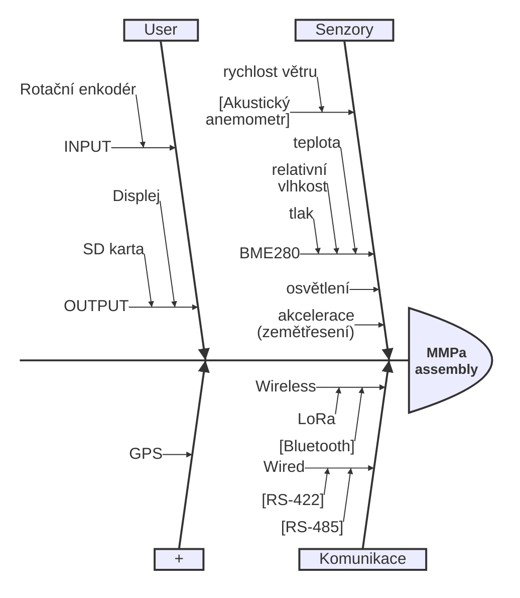

> [!IMPORTANT]
> ### Stanice `MMPa meteo` se momentálně skládá ze dvou desek.
> **[Deska vnější](/Informace/PCB-external)** je vybavena sensory, ze kterých po intervalech čte data a technologií [LoRa](/Informace/LoRa.md) je posílá desce vnitřní.  
> **[Deska vnitřní](/Informace/PCB-internal)** data přijímá z desky vnější, ukazuje je uživateli a zapisuje do SD karty.

> [!TIP]
> Projekt je budován tak, aby naplnil [základní kompetenční ustanovení](Informace/zakladni-kompetecni-listina.md).  
> Projekt při operaci musí naplňovat [stanovení MVP](Informace/MVP.md) (**M**inimum **V**iable **P**roduct).

## Složení stanice
`[`Ozávorkované`]` body čekají na implementaci.  

